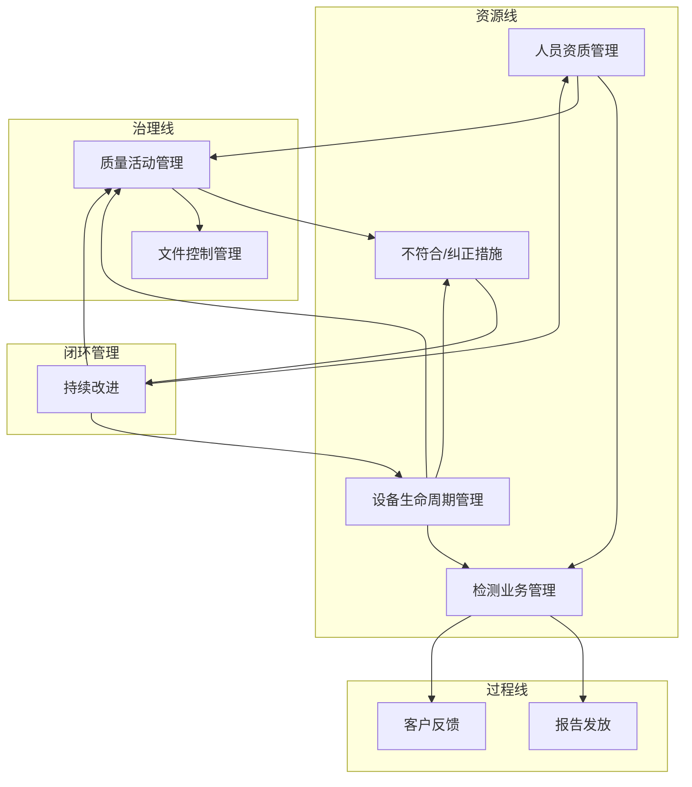
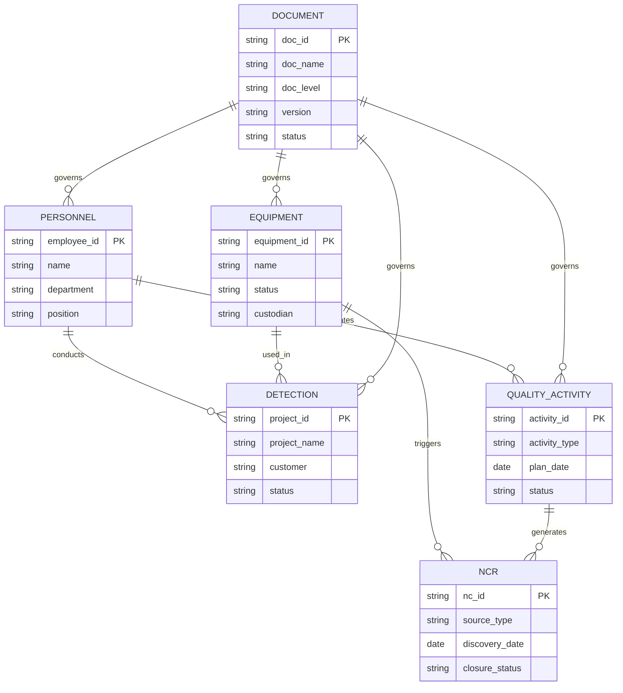

# CNAS实验室文件管理体系技术设计文档

## 1. 文档概述

**功能名称：** cnas-document-management-system
**更新日期：** 2026-04-29
**平台：** 钉钉多维表
**对应需求文档：** requirements.md

## 2. 系统架构

### 2.1 多维表空间设计

```
CNAS体系管理
├── 1.人员资质管理
├── 2.设备生命周期管理
├── 3.质量活动管理
│   ├── 3.1 质量控制计划子表
│   ├── 3.2 内部审核子表
│   └── 3.3 管理评审子表
├── 4.检测业务管理
├── 5.文件控制管理
├── 6.不符合/纠正措施
└── 7.基础数据配置
    ├── 7.1 部门配置
    ├── 7.2 岗位配置
    ├── 7.3 检测领域配置
    └── 7.4 设备状态配置
```

### 2.2 核心业务流程



## 3. 数据表详细设计

### 3.1 人员资质管理表

#### 表结构

| 字段名称 | 字段类型 | 必填 | 说明 |
|----------|----------|------|------|
| 工号 | 单行文本 | 是 | 唯一标识 |
| 姓名 | 单行文本 | 是 | - |
| 岗位 | 单选 | 是 | 关联岗位配置表 |
| 所属部门 | 单选 | 是 | 关联部门配置表 |
| 入职日期 | 日期 | 是 | - |
| 人员状态 | 单选 | 是 | 在职/离职/退休 |
| 联系邮箱 | 邮箱 | 否 | - |
| 联系电话 | 电话 | 否 | - |
| 教育背景 | 多行文本 | 否 | - |
| 专业特长 | 多行文本 | 否 | - |
| 备注 | 多行文本 | 否 | - |

#### 资质授权子表

| 字段名称 | 字段类型 | 必填 | 说明 |
|----------|----------|------|------|
| 授权类型 | 单选 | 是 | 检测领域授权/设备操作授权 |
| 授权名称 | 单行文本 | 是 | 具体授权项目 |
| 授权日期 | 日期 | 是 | - |
| 有效期至 | 日期 | 是 | - |
| 授权状态 | 单选 | 是 | 有效/待续期/已过期/暂停 |
| 授权证明 | 附件 | 否 | 证书扫描件 |
| 复核人 | 人员 | 是 | - |
| 下次监督日期 | 日期 | 否 | - |

#### 培训记录子表

| 字段名称 | 字段类型 | 必填 | 说明 |
|----------|----------|------|------|
| 培训主题 | 单行文本 | 是 | - |
| 培训类型 | 单选 | 是 | 内部培训/外部培训/在线学习 |
| 培训日期 | 日期 | 是 | - |
| 培训时长 | 数字 | 否 | 小时 |
| 培训结果 | 单选 | 否 | 合格/不合格/待评价 |
| 培训证书 | 附件 | 否 | 证书附件 |
| 培训讲师 | 人员 | 否 | - |
| 培训内容 | 多行文本 | 否 | - |

#### 监督记录子表

| 字段名称 | 字段类型 | 必填 | 说明 |
|----------|----------|------|------|
| 监督日期 | 日期 | 是 | - |
| 监督类型 | 单选 | 是 | 现场监督/报告审查/样品考核 |
| 监督内容 | 多行文本 | 是 | - |
| 监督结果 | 单选 | 是 | 满意/待改进/不满意 |
| 改进要求 | 多行文本 | 否 | - |
| 监督人 | 人员 | 是 | - |
| 改进完成日期 | 日期 | 否 | - |
| 验证人 | 人员 | 否 | - |
| 验证结果 | 单选 | 否 | 通过/不通过 |

#### 关键视图

| 视图名称 | 视图类型 | 筛选条件 | 用途 |
|----------|----------|----------|------|
| 全部人员 | 表格视图 | 无 | 主数据视图 |
| 授权到期预警 | 看板视图 | 有效期至 <= 30天后 | 授权续期提醒 |
| 待培训人员 | 分组视图 | 培训状态 = 未完成 | 培训计划跟踪 |
| 监督员看板 | 看板视图 | 按监督人分组 | 监督工作分配 |
| 人员能力监控 | 看板视图 | 按授权状态分组 | 能力状态总览 |

### 3.2 设备生命周期管理表

#### 表结构

| 字段名称 | 字段类型 | 必填 | 说明 |
|----------|----------|------|------|
| 设备编号 | 单行文本 | 是 | 唯一标识，格式：EQ-XXXX |
| 设备名称 | 单行文本 | 是 | - |
| 设备型号 | 单行文本 | 否 | - |
| 制造商 | 单行文本 | 否 | - |
| 资产标签 | 单行文本 | 否 | - |
| 存放位置 | 单选 | 是 | 关联位置配置 |
| 责任人 | 人员 | 是 | - |
| 设备状态 | 单选 | 是 | 在用/停用/报废/维修中/外出 |
| 验收日期 | 日期 | 否 | - |
| 启用日期 | 日期 | 否 | - |
| 报废日期 | 日期 | 否 | - |
| 设备照片 | 附件 | 否 | - |
| 操作SOP | 超链接 | 否 | 关联三级文件 |
| 备注 | 多行文本 | 否 | - |

#### 校准记录子表

| 字段名称 | 字段类型 | 必填 | 说明 |
|----------|----------|------|------|
| 校准日期 | 日期 | 是 | - |
| 校准机构 | 单行文本 | 是 | - |
| 校准证书编号 | 单行文本 | 否 | - |
| 校准结论 | 单选 | 是 | 合格/不合格/降级使用 |
| 下次校准日期 | 日期 | 是 | 自动计算 |
| 校准证书附件 | 附件 | 否 | - |
| 校准费用 | 数字 | 否 | 元 |
| 备注 | 多行文本 | 否 | - |

#### 期间核查记录子表

| 字段名称 | 字段类型 | 必填 | 说明 |
|----------|----------|------|------|
| 核查日期 | 日期 | 是 | - |
| 核查项目 | 单行文本 | 是 | - |
| 核查方法 | 单行文本 | 否 | - |
| 核查结果 | 单选 | 是 | 满意/不满意/可疑 |
| 核查结论 | 多行文本 | 否 | - |
| 核查人 | 人员 | 是 | - |
| 下次核查日期 | 日期 | 否 | - |
| 备注 | 多行文本 | 否 | - |

#### 维护记录子表

| 字段名称 | 字段类型 | 必填 | 说明 |
|----------|----------|------|------|
| 维护日期 | 日期 | 是 | - |
| 维护类型 | 单选 | 是 | 日常维护/定期维护/故障维修 |
| 维护项目 | 多行文本 | 是 | - |
| 维护结果 | 单选 | 是 | 正常/异常/待观察 |
| 维护人 | 人员 | 是 | - |
| 维护费用 | 数字 | 否 | 元 |
| 下次维护日期 | 日期 | 否 | - |
| 备注 | 多行文本 | 否 | - |

#### 关键视图

| 视图名称 | 视图类型 | 筛选条件 | 用途 |
|----------|----------|----------|------|
| 全部设备 | 表格视图 | 无 | 主数据视图 |
| 30天校准预警 | 看板视图 | 下次校准日期 <= 30天后 | 校准计划提醒 |
| 期间核查到期 | 看板视图 | 下次核查日期 <= 15天后 | 核查计划提醒 |
| 设备外出跟踪 | 看板视图 | 设备状态 = 外出 | 外出设备跟踪 |
| 维修中设备 | 看板视图 | 设备状态 = 维修中 | 维修进度跟踪 |
| 设备状态总览 | 分组视图 | 按设备状态分组 | 状态统计 |

### 3.3 质量活动管理表

本表包含3个子表，分别管理质量控制、内部审核和管理评审。

#### 3.3.1 质量控制计划子表

| 字段名称 | 字段类型 | 必填 | 说明 |
|----------|----------|------|------|
| 质控编号 | 单行文本 | 是 | 自动生成：QC-YYYY-NNN |
| 质控类型 | 单选 | 是 | 实验室间比对/能力验证/留样再测/加标回收/人员比对/设备比对/平行样/控制图 |
| 涉及检测项目 | 多选 | 是 | 关联检测能力范围 |
| 计划执行日期 | 日期 | 是 | - |
| 实际执行日期 | 日期 | 否 | - |
| 执行状态 | 单选 | 是 | 待执行/执行中/已完成/已取消 |
| 质控负责人 | 人员 | 是 | - |
| 结果评价 | 单选 | 否 | 满意/不满意/可疑/待评价 |
| 不符合项编号 | 超链接 | 否 | 关联不符合项表 |
| 关联程序文件 | 超链接 | 否 | QP-019、QP-020 |
| 备注 | 多行文本 | 否 | - |

#### 3.3.2 内部审核子表

| 字段名称 | 字段类型 | 必填 | 说明 |
|----------|----------|------|------|
| 内审编号 | 单行文本 | 是 | 自动生成：IA-YYYY-NNN |
| 审核年度 | 数字 | 是 | - |
| 审核轮次 | 单选 | 是 | 第一次/第二次/第三次/专项审核 |
| 计划审核日期 | 日期 | 是 | - |
| 实际审核日期 | 日期 | 否 | - |
| 审核组长 | 人员 | 是 | - |
| 审核员 | 多选 | 是 | - |
| 审核状态 | 单选 | 是 | 计划中/进行中/已完成 |
| 受审核部门 | 多选 | 是 | - |
| 不符合项数量 | 数字 | 否 | 自动统计 |
| 内审报告 | 附件 | 否 | - |
| 关联程序文件 | 超链接 | 否 | QP-030 |
| 备注 | 多行文本 | 否 | - |

#### 3.3.3 管理评审子表

| 字段名称 | 字段类型 | 必填 | 说明 |
|----------|----------|------|------|
| 管评编号 | 单行文本 | 是 | 自动生成：MR-YYYY-NNN |
| 评审年度 | 数字 | 是 | - |
| 计划评审日期 | 日期 | 是 | - |
| 实际评审日期 | 日期 | 否 | - |
| 主持人 | 人员 | 是 | - |
| 参与人员 | 多选 | 是 | - |
| 评审状态 | 单选 | 是 | 计划中/已完成 |
| 输入材料-上次管理评审决议跟踪 | 多选 | 否 | 复选框 |
| 输入材料-内审结果 | 多选 | 否 | 复选框 |
| 输入材料-质量控制活动结果 | 多选 | 否 | 复选框 |
| 输入材料-人员培训情况 | 多选 | 否 | 复选框 |
| 输入材料-设备校准和核查情况 | 多选 | 否 | 复选框 |
| 输入材料-客户反馈和投诉 | 多选 | 否 | 复选框 |
| 输入材料-不符合项和纠正措施 | 多选 | 否 | 复选框 |
| 输入材料-风险和机遇 | 多选 | 否 | 复选框 |
| 输出决议 | 多行文本 | 否 | - |
| 改进事项数量 | 数字 | 否 | 自动统计 |
| 改进完成率 | 公式 | 否 | 自动计算 |
| 关联程序文件 | 超链接 | 否 | QP-031 |
| 备注 | 多行文本 | 否 | - |

#### 关键视图

| 视图名称 | 视图类型 | 筛选条件 | 用途 |
|----------|----------|----------|------|
| 质量控制看板 | 看板视图 | 按执行状态分组 | 质控活动跟踪 |
| 待执行质控 | 表格视图 | 执行状态 = 待执行 | 近期质控计划 |
| 内审跟踪 | 时间线视图 | 按审核年度分组 | 内审进度 |
| 管评看板 | 看板视图 | 按评审状态分组 | 管评进度 |
| 改进事项总览 | 分组视图 | 按改进完成率分组 | 管评闭环跟踪 |

### 3.4 检测业务管理表

#### 表结构

| 字段名称 | 字段类型 | 必填 | 说明 |
|----------|----------|------|------|
| 项目编号 | 单行文本 | 是 | 自动生成：PRJ-YYYY-NNNN |
| 项目名称 | 单行文本 | 是 | - |
| 客户名称 | 单行文本 | 是 | - |
| 客户联系人 | 单行文本 | 否 | - |
| 客户联系电话 | 电话 | 否 | - |
| 检测领域 | 多选 | 是 | 关联检测能力范围 |
| 申请日期 | 日期 | 是 | - |
| 计划完成日期 | 日期 | 是 | - |
| 实际完成日期 | 日期 | 否 | - |
| 项目状态 | 单选 | 是 | 申请受理/合同评审/样品接收/检测执行/数据复核/报告编制/审批中/已发放/已完成/已取消 |
| 项目负责人 | 人员 | 是 | - |
| 检测人员 | 多选 | 否 | 关联人员资质表 |
| 复核人员 | 多选 | 否 | 关联人员资质表 |
| 关联AI测试项目 | 超链接 | 否 | 关联AI测试管理Base |
| 备注 | 多行文本 | 否 | - |

#### 检测方法子表

| 字段名称 | 字段类型 | 必填 | 说明 |
|----------|----------|------|------|
| 检测方法标准 | 单行文本 | 是 | - |
| 检测方法名称 | 单行文本 | 是 | - |
| 方法确认状态 | 单选 | 是 | 已确认/待确认/不适用 |
| 方法确认日期 | 日期 | 否 | - |
| 方法确认人 | 人员 | 否 | - |
| 备注 | 多行文本 | 否 | - |

#### 样品记录子表

| 字段名称 | 字段类型 | 必填 | 说明 |
|----------|----------|------|------|
| 样品名称 | 单行文本 | 是 | - |
| 样品编号 | 单行文本 | 是 | - |
| 样品数量 | 数字 | 是 | - |
| 样品规格 | 单行文本 | 否 | - |
| 接收日期 | 日期 | 是 | - |
| 样品状态 | 单选 | 是 | 待检/在检/检毕/留样/已处置 |
| 接收时外观 | 多行文本 | 否 | - |
| 储存条件 | 单选 | 否 | 室温/冷藏/冷冻/其他 |
| 处置日期 | 日期 | 否 | - |
| 处置方式 | 单选 | 否 | 归还/销毁/留样 |
| 备注 | 多行文本 | 否 | - |

#### 报告记录子表

| 字段名称 | 字段类型 | 必填 | 说明 |
|----------|----------|------|------|
| 报告编号 | 单行文本 | 否 | - |
| 报告份数 | 数字 | 否 | - |
| 报告编制日期 | 日期 | 否 | - |
| 报告审批日期 | 日期 | 否 | - |
| 报告发放日期 | 日期 | 否 | - |
| 报告发放方式 | 单选 | 否 | 自取/邮寄/电子版 |
| 报告状态 | 单选 | 否 | 编制中/待审批/已批准/已发放/已更改 |
| 客户签收确认 | 单选 | 否 | 已签收/未签收 |
| 客户满意度 | 单选 | 否 | 满意/基本满意/不满意 |
| 客户反馈意见 | 多行文本 | 否 | - |
| 更改原因 | 多行文本 | 否 | - |
| 更改报告编号 | 单行文本 | 否 | - |

#### 关键视图

| 视图名称 | 视图类型 | 筛选条件 | 用途 |
|----------|----------|----------|------|
| 全部项目 | 表格视图 | 无 | 主数据视图 |
| 我的待办检测 | 看板视图 | 检测人员 = 当前用户 AND 项目状态 NOT IN 已完成,已取消 | 个人工作台 |
| 超期案子 | 看板视图 | 计划完成日期 < 今日 AND 项目状态 NOT IN 已完成,已取消 | 超期预警 |
| 待审批报告 | 看板视图 | 报告状态 = 待审批 | 审批提醒 |
| 客户看板 | 分组视图 | 按客户名称分组 | 客户项目统计 |
| 检测进度跟踪 | 时间线视图 | 按项目状态排序 | 全流程可视化 |

### 3.5 文件控制管理表

#### 表结构

| 字段名称 | 字段类型 | 必填 | 说明 |
|----------|----------|------|------|
| 文件编号 | 单行文本 | 是 | 唯一标识 |
| 文件名称 | 单行文本 | 是 | - |
| 文件层级 | 单选 | 是 | 一级手册/二级程序/三级SOP/四级记录 |
| 对应CNAS章节 | 多选 | 否 | 4.1-8.9全要素 |
| 当前版本 | 单行文本 | 是 | 格式：X.X |
| 生效日期 | 日期 | 是 | - |
| 编制人 | 人员 | 是 | - |
| 审核人 | 人员 | 是 | - |
| 批准人 | 人员 | 是 | - |
| 分发范围 | 多选 | 是 | 相关部门和岗位 |
| 文件状态 | 单选 | 是 | 现行有效/修订中/废止/待发布 |
| 下次评审日期 | 日期 | 否 | - |
| 文件链接 | 超链接 | 否 | 云盘文件链接 |
| 作废文件链接 | 超链接 | 否 | 作废版本存档 |
| 备注 | 多行文本 | 否 | - |

#### 修订历史子表

| 字段名称 | 字段类型 | 必填 | 说明 |
|----------|----------|------|------|
| 修订版本 | 单行文本 | 是 | - |
| 修订日期 | 日期 | 是 | - |
| 修订内容 | 多行文本 | 是 | - |
| 修订原因 | 多行文本 | 是 | - |
| 审核人 | 人员 | 是 | - |
| 批准人 | 人员 | 是 | - |
| 修订人 | 人员 | 是 | - |

#### 关键视图

| 视图名称 | 视图类型 | 筛选条件 | 用途 |
|----------|----------|----------|------|
| 全部文件 | 表格视图 | 无 | 主数据视图 |
| 待评审文件 | 看板视图 | 下次评审日期 <= 30天后 | 文件评审提醒 |
| 修订中文件 | 看板视图 | 文件状态 = 修订中 | 修订进度跟踪 |
| 按章节浏览 | 分组视图 | 按对应CNAS章节分组 | 按标准浏览 |
| 按层级浏览 | 分组视图 | 按文件层级分组 | 按层级浏览 |
| 废止文件存档 | 表格视图 | 文件状态 = 废止 | 历史存档查阅 |

### 3.6 不符合/纠正措施表

#### 表结构

| 字段名称 | 字段类型 | 必填 | 说明 |
|----------|----------|------|------|
| 不符合项编号 | 单行文本 | 是 | 自动生成：NC-YYYY-NNN |
| 来源类型 | 单选 | 是 | 内审/管评/日常监督/客户投诉/能力验证不满意/外部评审/自我发现 |
| 来源活动 | 超链接 | 否 | 关联内审/管评/质控记录 |
| 发现日期 | 日期 | 是 | - |
| 责任部门 | 单选 | 是 | - |
| 责任人 | 人员 | 是 | - |
| 不符合描述 | 多行文本 | 是 | - |
| 原因分析 | 多行文本 | 否 | - |
| 纠正措施 | 多行文本 | 否 | - |
| 措施负责人 | 人员 | 否 | - |
| 计划完成日期 | 日期 | 是 | - |
| 实际完成日期 | 日期 | 否 | - |
| 验证人 | 人员 | 是 | - |
| 验证日期 | 日期 | 否 | - |
| 验证结果 | 单选 | 否 | 通过/不通过 |
| 闭环状态 | 单选 | 是 | 待分析/措施制定中/实施中/待验证/已关闭 |
| 关联程序文件 | 超链接 | 否 | QP-024、QP-029 |
| 备注 | 多行文本 | 否 | - |

#### 关键视图

| 视图名称 | 视图类型 | 筛选条件 | 用途 |
|----------|----------|----------|------|
| 全部记录 | 表格视图 | 无 | 主数据视图 |
| 我的待办 | 看板视图 | 责任人 = 当前用户 AND 闭环状态 NOT IN 已关闭 | 个人整改任务 |
| 超期未关闭 | 看板视图 | 计划完成日期 < 今日 AND 闭环状态 NOT IN 已关闭 | 超期预警 |
| 按来源统计 | 分组视图 | 按来源类型分组 | 来源分析 |
| 闭环率仪表盘 | 仪表盘视图 | 按闭环状态统计 | 整体闭环情况 |

## 4. 表间关联配置

### 4.1 关联关系总览



### 4.2 关联字段配置

| 源表 | 目标表 | 关联字段 | 配置方式 |
|------|--------|----------|----------|
| 人员资质管理 | 检测业务管理 | 检测人员、复核人员 | 关联人员资质表的工号 |
| 人员资质管理 | 质量活动管理 | 质控负责人、内审员 | 关联人员资质表的工号 |
| 设备生命周期管理 | 检测业务管理 | 检测设备 | 关联设备编号 |
| 质量活动管理 | 不符合/纠正措施 | 来源活动 | 关联质控/内审/管评编号 |
| 检测业务管理 | 文件控制管理 | 关联程序文件 | 超链接字段 |

### 4.3 数据联动配置

| 触发条件 | 联动动作 | 实现方式 |
|----------|----------|----------|
| 人员授权到期 | 自动发送钉钉通知 | 钉钉自动化 |
| 设备校准到期前30天 | 更新校准预警视图 | 公式字段+视图筛选 |
| 质控结果不满意 | 自动创建不符合项 | 钉钉自动化 |
| 不符合项整改超期 | 自动发送钉钉通知 | 钉钉自动化 |

## 5. 预警规则配置

### 5.1 预警规则清单

| 序号 | 预警对象 | 预警规则 | 预警时间 | 通知对象 | 实现方式 |
|------|----------|----------|----------|----------|----------|
| 1 | 人员授权 | 有效期至 <= 30天 | 每天检查 | 人事专员、质量负责人 | 钉钉自动化 |
| 2 | 人员培训 | 年度培训计划未完成 | 每年12月 | 人事专员、部门主管 | 视图筛选+提醒 |
| 3 | 设备校准 | 下次校准日期 <= 30天 | 每天检查 | 设备管理员 | 钉钉自动化 |
| 4 | 设备期间核查 | 下次核查日期 <= 15天 | 每天检查 | 设备管理员 | 钉钉自动化 |
| 5 | 质控活动 | 计划执行日期已过3天未完成 | 每天检查 | 质控负责人 | 钉钉自动化 |
| 6 | 内审不符合项 | 计划完成日期已过未关闭 | 每天检查 | 责任人、验证人 | 钉钉自动化 |
| 7 | 文件评审 | 下次评审日期 <= 30天 | 每周一 | 文件管理员 | 钉钉自动化 |
| 8 | 检测项目 | 计划完成日期已过未完成 | 每天检查 | 项目负责人 | 钉钉自动化 |

### 5.2 钉钉自动化配置示例

```
触发条件：每日定时检查
条件判断：
  - IF 人员资质管理.有效期至 - TODAY() <= 30
  - OR 设备生命周期管理.下次校准日期 - TODAY() <= 30
执行动作：
  - 发送钉钉消息给相关责任人
  - 消息内容包含：预警类型、预警内容、待办链接
```

## 6. 权限设计

### 6.1 角色定义

| 角色 | 职责 | 数据权限 | 功能权限 |
|------|------|----------|----------|
| 质量负责人 | 体系管理、质量活动管理 | 全部数据读写 | 全部功能 |
| 文件管理员 | 文件控制管理 | 文件控制表读写 | 文件录入、修订、评审 |
| 设备管理员 | 设备管理 | 设备表读写 | 设备录入、校准、维护 |
| 人事专员 | 人员管理 | 人员表读写 | 人员录入、培训、资质 |
| 检测人员 | 检测执行 | 检测业务表读写 | 检测进度更新、报告编制 |
| 访客 | 数据查看 | 只读权限 | 仅查看已授权数据 |

### 6.2 权限配置矩阵

| 数据表 | 质量负责人 | 文件管理员 | 设备管理员 | 人事专员 | 检测人员 |
|--------|------------|------------|------------|----------|----------|
| 人员资质管理 | RW | R | R | RW | R(本人) |
| 设备生命周期管理 | RW | R | RW | R | R(相关) |
| 质量活动管理 | RW | R | R | R | R |
| 检测业务管理 | RW | R | R | R | RW(相关) |
| 文件控制管理 | RW | RW | R | R | R |
| 不符合/纠正措施 | RW | R | R | R | R(相关) |

注：R=只读，RW=读写

## 7. 仪表盘设计

### 7.1 质量负责人驾驶舱

| 指标 | 展示形式 | 数据来源 |
|------|----------|----------|
| 人员资质状态统计 | 饼图 | 人员资质管理表 |
| 设备状态统计 | 环形图 | 设备生命周期表 |
| 年度质量活动完成率 | 仪表盘 | 质量活动管理表 |
| 不符合项闭环率 | 漏斗图 | 不符合/纠正措施表 |
| 检测项目进度分布 | 柱状图 | 检测业务管理表 |
| 超期项目预警 | 列表 | 检测业务管理表 |

### 7.2 设备管理员看板

| 指标 | 展示形式 | 数据来源 |
|------|----------|----------|
| 设备状态分布 | 饼图 | 设备生命周期表 |
| 30天内到期校准清单 | 列表 | 设备生命周期表 |
| 期间核查到期清单 | 列表 | 设备生命周期表 |
| 设备维护计划 | 日历视图 | 设备生命周期表 |
| 设备使用频率统计 | 柱状图 | 检测业务管理表 |

### 7.3 人员管理员看板

| 指标 | 展示形式 | 数据来源 |
|------|----------|----------|
| 在职人员统计 | 数字卡片 | 人员资质管理表 |
| 授权到期预警 | 列表 | 人员资质管理表 |
| 待培训人员清单 | 列表 | 人员资质管理表 |
| 监督计划执行情况 | 柱状图 | 人员资质管理表 |
| 人员能力分布 | 雷达图 | 人员资质管理表 |

## 8. 实施步骤

### 8.1 第一阶段：基础搭建（第1周）

| 步骤 | 任务 | 交付物 | 责任人 |
|------|------|--------|--------|
| 1.1 | 创建钉钉多维表空间 | 多维表空间 | 实施顾问 |
| 1.2 | 建立7张基础数据表 | 表结构文档 | 实施顾问 |
| 1.3 | 配置基础字段 | 字段配置清单 | 实施顾问 |
| 1.4 | 建立部门、岗位等基础配置 | 基础数据录入 | 实验室 |
| 1.5 | 导入现有文件索引（86条记录） | 文件索引清单 | 实验室 |

### 8.2 第二阶段：数据填充（第2-3周）

| 步骤 | 任务 | 交付物 | 责任人 |
|------|------|--------|--------|
| 2.1 | 导入设备台账数据 | 设备台账 | 设备管理员 |
| 2.2 | 录入全部人员信息 | 人员信息表 | 人事专员 |
| 2.3 | 建立检测能力范围清单 | 能力范围表 | 质量负责人 |
| 2.4 | 录入年度质量活动计划 | 质控计划、内审计划、管评计划 | 质量负责人 |
| 2.5 | 配置表间关联关系 | 关联配置文档 | 实施顾问 |

### 8.3 第三阶段：流程运行（持续）

| 步骤 | 任务 | 交付物 | 责任人 |
|------|------|--------|--------|
| 3.1 | 启用新案子流程 | 新增检测项目 | 检测人员 |
| 3.2 | 启用预警通知 | 预警消息 | 系统 |
| 3.3 | 不符合项统一闭环 | 不符合项记录 | 各责任人 |
| 3.4 | 日常数据更新维护 | 数据更新记录 | 各角色 |

### 8.4 第四阶段：优化迭代（每季度）

| 步骤 | 任务 | 交付物 | 责任人 |
|------|------|--------|--------|
| 4.1 | 回顾视图使用情况 | 使用率报告 | 质量负责人 |
| 4.2 | 调整字段和视图配置 | 优化配置 | 实施顾问 |
| 4.3 | 增加趋势分析和仪表盘 | 报表迭代 | 实施顾问 |
| 4.4 | 培训新功能和流程优化 | 培训记录 | 质量负责人 |

## 9. 验收标准

### 9.1 功能验收

| 序号 | 验收项 | 验收标准 | 测试方法 |
|------|--------|----------|----------|
| 1 | 6张核心表创建完成 | 表结构与设计一致 | 对照文档检查 |
| 2 | 字段配置正确 | 必填项、字段类型正确 | 功能测试 |
| 3 | 表间关联生效 | 关联数据可正常引用 | 关联查询测试 |
| 4 | 视图配置完成 | 8个关键视图可正常使用 | 功能测试 |
| 5 | 预警规则配置 | 预警消息可正常触发 | 模拟测试 |
| 6 | 权限配置生效 | 各角色仅可访问授权数据 | 权限测试 |

### 9.2 数据验收

| 序号 | 验收项 | 验收标准 | 测试方法 |
|------|--------|----------|----------|
| 1 | 人员数据完整 | 全部在职人员已录入 | 数据比对 |
| 2 | 设备数据完整 | 全部设备已录入 | 数据比对 |
| 3 | 文件索引完整 | 86条记录+32份QP+80+R表已录入 | 数据比对 |
| 4 | 能力范围完整 | 全部CNAS认可项目已录入 | 数据比对 |
| 5 | 年度计划录入 | 质控、内审、管评计划已录入 | 数据比对 |

## 10. 培训计划

### 10.1 培训对象与内容

| 培训对象 | 培训内容 | 培训时长 | 培训方式 |
|----------|----------|----------|----------|
| 质量负责人 | 全部功能、预警配置、仪表盘 | 2小时 | 现场培训 |
| 文件管理员 | 文件控制模块、修订流程 | 1小时 | 现场培训 |
| 设备管理员 | 设备模块、校准维护流程 | 1小时 | 现场培训 |
| 人事专员 | 人员模块、培训监督流程 | 1小时 | 现场培训 |
| 检测人员 | 检测业务模块使用 | 1小时 | 现场培训 |

### 10.2 培训材料

- 用户操作手册
- 常见问题FAQ
- 视频教程（可选）

## 11. 后续维护

### 11.1 日常维护

| 维护项 | 维护内容 | 维护频率 | 责任人 |
|--------|----------|----------|--------|
| 数据备份 | 多维表数据导出备份 | 每月 | IT支持 |
| 权限变更 | 新增用户、权限调整 | 按需 | 质量负责人 |
| 表结构优化 | 字段调整、视图优化 | 按需 | 实施顾问 |

### 11.2 持续改进

- 每季度收集用户反馈
- 根据CNAS评审要求调整
- 积累数据后增加高级分析功能

## 12. 参考文档

[^1]: CNAS-CL01:2018 检测和校准实验室能力认可准则
[^2]: CNAS体系多维表构建方案.docx - 原始需求文档