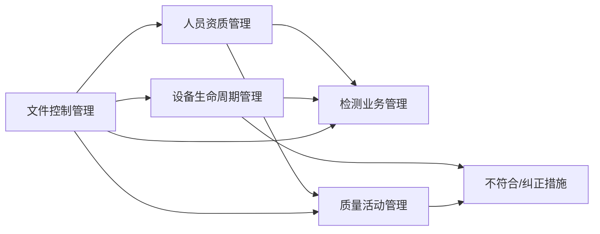

# CNAS实验室文件管理体系需求文档

## 1. 引言

### 1.1 项目概述

本项目旨在构建一套基于钉钉多维表的CNAS实验室文件管理体系，实现实验室质量管理活动的数字化、流程化、智能化管理。系统围绕人员和资源管理、检测业务流程、质量控制活动三条主线，覆盖CNAS-CL01:2018全部要素（4.1~8.9）。

### 1.2 适用范围

本体系适用于通过或准备通过CNAS认可的检测实验室，满足ISO/IEC 17025:2017和CNAS-CL01:2018的合规要求。

### 1.3 术语定义

| 术语 | 定义 |
|------|------|
| CNAS | 中国合格评定国家认可委员会 |
| 多维表 | 钉钉提供的多视图数据管理表格，支持多种视图和数据关联 |
| 主线 | 贯穿实验室管理的核心业务链路 |
| 能力范围 | 实验室经过确认的检测能力清单 |

## 2. 核心需求

### 2.1 人员主线

**用户故事：** 作为质量负责人，我需要对实验室人员的资质、培训、监督进行全生命周期管理，确保每位检测人员的能力持续满足要求。

#### 2.1.1 人员资质管理

**REQ-PER-001：人员信息维护**

系统 SHALL 支持维护人员基本信息，包括工号、姓名、岗位、所属部门、入职日期。

**验收标准：**

1. WHEN 新人员入职，系统 SHALL 提供新增人员记录功能
2. WHEN 人员岗位变动，系统 SHALL 支持更新岗位和部门信息
3. IF 人员离职，系统 SHALL 支持将状态标记为"离职"并保留历史记录

**REQ-PER-002：资质授权管理**

系统 SHALL 支持管理人员的检测领域授权和设备操作授权。

**验收标准：**

1. WHEN 人员获得新的检测领域授权，系统 SHALL 记录授权日期和授权有效期
2. WHILE 人员授权处于有效状态，系统 SHALL 在授权到期前30天显示预警
3. IF 授权到期未续期，系统 SHALL 自动将授权状态变更为"待续期"

**REQ-PER-003：培训计划与执行**

系统 SHALL 支持制定年度培训计划并跟踪培训执行情况。

**验收标准：**

1. WHEN 年初或人员入职，系统 SHALL 支持创建年度培训计划
2. WHEN 培训完成，系统 SHALL 支持录入培训记录包括培训主题、培训日期、培训结果
3. IF 计划培训未在当年度完成，系统 SHALL 在年度末生成待培训清单

**REQ-PER-004：人员监督跟踪**

系统 SHALL 支持记录人员监督活动并跟踪监督结果。

**验收标准：**

1. WHEN 监督活动完成，系统 SHALL 支持录入监督记录包括被监督人、监督人、监督日期、监督内容、监督结果
2. WHILE 人员监督结果为"待改进"，系统 SHALL 生成改进任务并跟踪闭环
3. IF 人员连续2次监督结果为"待改进"，系统 SHALL 提示暂停其相关检测授权

### 2.2 设备主线

**用户故事：** 作为设备管理员，我需要对实验室设备的校准、维护、期间核查进行全生命周期管理，确保设备持续满足检测要求。

#### 2.2.1 设备台账管理

**REQ-EQP-001：设备基本信息维护**

系统 SHALL 支持维护设备基本信息，包括设备编号、名称、型号、制造商、资产标签、存放位置、责任人。

**验收标准：**

1. WHEN 新设备采购入库，系统 SHALL 支持新增设备记录
2. WHEN 设备信息变更，系统 SHALL 支持更新设备信息并保留历史变更记录
3. IF 设备需要调拨或归还，系统 SHALL 支持更新存放位置和责任人

**REQ-EQP-002：设备状态管理**

系统 SHALL 支持跟踪设备状态变更历史。

**验收标准：**

1. WHEN 设备状态发生变更，系统 SHALL 记录变更日期、变更原因、新状态
2. 系统 SHALL 支持的设备状态包括：在用、停用、报废、维修中、外出送校
3. IF 设备处于维修中或外出状态，系统 SHALL 在检测业务管理中显示设备不可用提示

**REQ-EQP-003：设备验收与启用**

系统 SHALL 支持记录设备验收和启用信息。

**验收标准：**

1. WHEN 设备完成验收，系统 SHALL 支持录入验收日期、验收结论、启用日期
2. IF 验收结论为"不合格"，系统 SHALL 将设备状态自动设置为"停用"并触发不合格处理流程

#### 2.2.2 计量溯源管理

**REQ-EQP-004：校准计划与执行**

系统 SHALL 支持管理设备校准计划并跟踪校准执行情况。

**验收标准：**

1. WHEN 设备完成首次校准，系统 SHALL 根据校准周期自动计算下次校准日期
2. WHILE 校准有效期小于30天，系统 SHALL 显示预警
3. IF 校准结果为"不合格"，系统 SHALL 自动创建不符合项记录并通知责任人

**REQ-EQP-005：期间核查管理**

系统 SHALL 支持管理设备期间核查计划并跟踪执行情况。

**验收标准：**

1. WHEN 设备需要期间核查，系统 SHALL 支持制定期间核查计划包括核查周期、核查项目、核查方法
2. WHEN 期间核查完成，系统 SHALL 支持录入核查日期、核查结果、核查结论
3. IF 期间核查结果为"不满意"，系统 SHALL 自动创建不符合项记录

#### 2.2.3 设备维护管理

**REQ-EQP-006：设备维护计划与执行**

系统 SHALL 支持管理设备维护计划并跟踪维护执行情况。

**验收标准：**

1. WHEN 设备需要定期维护，系统 SHALL 支持制定维护计划包括维护周期、维护项目、维护负责人
2. WHEN 维护完成，系统 SHALL 支持录入维护记录包括维护日期、维护内容、维护结果、维护人

### 2.3 质量控制主线

**用户故事：** 作为质量负责人，我需要确保质量控制活动按计划执行，内审和管理评审发现的问题得到有效闭环。

#### 2.3.1 质量控制活动管理

**REQ-QC-001：质量控制计划管理**

系统 SHALL 支持制定和跟踪年度质量控制计划。

**验收标准：**

1. WHEN 年初，系统 SHALL 支持创建年度质量控制计划包括质控类型、计划执行日期、涉及检测项目、负责人
2. WHILE 质控活动计划执行日期已过但未完成，系统 SHALL 显示预警
3. IF 质控结果为"不满意"或"可疑"，系统 SHALL 自动创建不符合项记录

**REQ-QC-002：能力验证管理**

系统 SHALL 支持管理能力验证计划的制定和结果录入。

**验收标准：**

1. WHEN 能力验证计划下达，系统 SHALL 支持录入计划信息包括验证项目、验证机构、计划日期
2. WHEN 能力验证结果返回，系统 SHALL 支持录入结果包括结果评价、整改要求
3. IF 能力验证结果为"不满意"，系统 SHALL 自动创建不符合项并启动整改流程

#### 2.3.2 内部审核管理

**REQ-QC-003：内审计划与执行**

系统 SHALL 支持管理年度内审计划并跟踪内审执行情况。

**验收标准：**

1. WHEN 年度内审计划制定，系统 SHALL 支持录入计划信息包括审核年度、审核轮次、计划日期、审核组长、审核员
2. WHEN 内审完成，系统 SHALL 支持录入内审报告包括审核日期、受审核部门、不符合项数量、不符合项详情
3. IF 不符合项创建，系统 SHALL 自动将不符合项关联到对应的责任部门和责任人

**REQ-QC-004：内审不符合项跟踪**

系统 SHALL SHALL 支持跟踪内审不符合项的整改闭环情况。

**验收标准：**

1. WHEN 不符合项创建，系统 SHALL 自动通知责任部门和责任人
2. WHILE 不符合项整改超期未完成，系统 SHALL 显示预警
3. IF 不符合项整改完成并经验证，系统 SHALL 将不符合项状态更新为"已关闭"

#### 2.3.3 管理评审管理

**REQ-QC-005：管理评审计划与执行**

系统 SHALL 支持管理年度管理评审计划并跟踪评审执行情况。

**验收标准：**

1. WHEN 年度管理评审计划制定，系统 SHALL 支持录入计划信息包括评审年度、计划日期、主持人、参与人员
2. WHEN 管理评审完成，系统 SHALL 支持录入评审输入材料清单、输出决议、改进事项
3. IF 改进事项创建，系统 SHALL 自动计算改进完成率并跟踪闭环情况

### 2.4 检测业务主线

**用户故事：** 作为检测人员或项目经理，我需要对检测业务从申请到报告发放的全流程进行跟踪，确保每个案子按时按质完成。

#### 2.4.1 检测项目全流程管理

**REQ-TST-001：检测项目创建与跟踪**

系统 SHALL 支持创建检测项目并跟踪项目全流程进度。

**验收标准：**

1. WHEN 客户提交检测申请，系统 SHALL 支持创建检测项目记录包括项目编号、客户名称、项目名称、检测领域、检测方法
2. IF 检测方法尚未确认，系统 SHALL 将方法确认状态标记为"待确认"
3. WHILE 检测项目进行中，系统 SHALL 支持更新项目进度并显示当前阶段

**REQ-TST-002：样品管理**

系统 SHALL 支持管理检测样品的接收、流转、存储、处置。

**验收标准：**

1. WHEN 样品接收，系统 SHALL 支持录入样品信息包括样品名称、样品数量、接收日期、样品状态
2. IF 样品状态变更，系统 SHALL 记录变更日期和变更原因
3. WHILE 样品处于"待检"状态超过预定周期，系统 SHALL 显示预警

**REQ-TST-003：报告管理**

系统 SHALL 支持管理检测报告的编制、审批、发放、更改。

**验收标准：**

1. WHEN 报告编制完成，系统 SHALL 支持更新报告状态包括报告编号、报告状态
2. IF 报告需要更改，系统 SHALL 支持创建报告更改记录并说明更改原因
3. IF 报告已发放，客户满意度调查完成，系统 SHALL 支持录入客户满意度评价

#### 2.4.2 检测能力范围管理

**REQ-TST-004：检测能力范围清单**

系统 SHALL 支持维护实验室检测能力范围清单。

**验收标准：**

1. WHEN 实验室获得新的检测能力授权，系统 SHALL 支持新增能力范围记录包括检测领域、检测项目、检测标准、检测参数
2. IF 检测能力范围发生变更，系统 SHALL 记录变更历史并更新当前状态

### 2.5 体系文件主线

**用户故事：** 作为文件管理员，我需要确保体系文件受控管理，版本清晰、分发明确、修订可追溯。

#### 2.5.1 文件控制管理

**REQ-DOC-001：文件索引管理**

系统 SHALL 支持建立和维护文件索引，覆盖质量手册、程序文件、操作指导书、记录模板全部层级。

**验收标准：**

1. WHEN 新增文件，系统 SHALL 支持录入文件信息包括文件编号、文件名称、文件层级、对应CNAS章节、当前版本、生效日期
2. IF 文件修订，系统 SHALL 自动更新版本号并保留修订历史
3. WHILE 文件下次评审日期小于30天，系统 SHALL 显示预警

**REQ-DOC-002：文件分发管理**

系统 SHALL 支持管理文件的分发和回收。

**验收标准：**

1. WHEN 文件发布或修订，系统 SHALL 支持设置分发范围并记录分发日期、分发数量
2. IF 文件修订后重新发布，旧版本文件 SHALL 自动标记为"废止"并记录废止日期
3. IF 文件废止，系统 SHALL 支持关联废止文件的存档位置

**REQ-DOC-003：文件修订历史管理**

系统 SHALL 支持记录文件的修订历史。

**验收标准：**

1. WHEN 文件发生修订，系统 SHALL 支持录入修订记录包括修订日期、修订内容、修订原因、审核人、批准人
2. IF 文件历史版本被调用，系统 SHALL 支持快速定位和查看历史版本

### 2.6 不符合项与纠正措施管理

**用户故事：** 作为质量负责人，我需要确保所有发现的不符合项得到有效处理和闭环，防止问题重复发生。

#### 2.6.1 不符合项全生命周期管理

**REQ-NCR-001：不符合项创建与跟踪**

系统 SHALL 支持创建不符合项记录并跟踪处理进度。

**验收标准：**

1. WHEN 发现不符合项，系统 SHALL 支持创建记录包括不符合编号、来源类型、发现日期、不符合描述、责任部门、责任人、计划完成日期
2. IF 不符合项来源为内审，系统 SHALL 自动关联内审记录
3. IF 不符合项来源为能力验证不满意，系统 SHALL 自动关联能力验证记录

**REQ-NCR-002：原因分析与纠正措施**

系统 SHALL 支持录入不符合项的原因分析和纠正措施。

**验收标准：**

1. WHEN 责任部门完成原因分析，系统 SHALL 支持录入原因分析内容
2. IF 纠正措施制定，系统 SHALL 支持录入纠正措施内容、措施负责人、计划完成日期
3. IF 纠正措施实施完成，系统 SHALL 通知验证人进行验证

**REQ-NCR-003：不符合项闭环管理**

系统 SHALL 支持不符合项的验证和闭环。

**验收标准：**

1. WHEN 验证人完成验证，系统 SHALL 支持录入验证结果包括验证人、验证日期、验证结论
2. IF 验证结果为"通过"，系统 SHALL 将不符合项状态更新为"已关闭"
3. IF 验证结果为"不通过"，系统 SHALL 将不符合项状态更新为"待重新实施"并通知责任人

### 2.7 预警与通知

#### 2.7.1 预警规则

**REQ-ALR-001：预警规则配置**

系统 SHALL 支持配置和管理预警规则。

**验收标准：**

1. IF 人员授权到期前30天，系统 SHALL 发送预警通知
2. IF 设备校准到期前30天，系统 SHALL 发送预警通知
3. IF 设备期间核查到期前15天，系统 SHALL 发送预警通知
4. IF 质控活动计划执行日期已过3天未完成，系统 SHALL 发送预警通知
5. IF 不符合项整改超期未完成，系统 SHALL 发送预警通知
6. IF 文件下次评审日期小于30天，系统 SHALL 发送预警通知

**REQ-ALR-002：预警通知发送**

系统 SHALL 支持通过钉钉消息发送预警通知。

**验收标准：**

1. WHEN 预警规则触发，系统 SHALL 通过钉钉消息通知相关责任人和负责人
2. IF 预警内容涉及多个部门，系统 SHALL 同时通知所有相关责任人

### 2.8 报表与仪表盘

#### 2.8.1 数据统计

**REQ-RPT-001：统计数据展示**

系统 SHALL 支持提供关键数据的统计和展示。

**验收标准：**

1. WHEN 用户访问仪表盘，系统 SHALL 展示人员资质状态统计包括：有效授权人数、待续期人数、待培训人数
2. WHEN 用户访问仪表盘，系统 SHALL 展示设备状态统计包括：在用设备数、待校准设备数、核查到期设备数
3. WHEN 用户访问仪表盘，系统 SHALL 展示质量活动状态统计包括：年度质控计划完成率、内审不符合项闭环率、管评改进事项完成率
4. WHEN 用户访问仪表盘，系统 SHALL 展示检测业务统计包括：在检项目数、待审批报告数、超期项目数

## 3. 非功能需求

### 3.1 性能需求

- 系统 SHALL 支持至少100个并发用户访问
- 系统 SHALL 保证页面加载时间不超过3秒
- 系统 SHALL 支持单表数据量达到10000条记录

### 3.2 安全需求

- 系统 SHALL 支持基于钉钉组织架构的权限管理
- 系统 SHALL 支持记录级权限控制，敏感数据仅对授权人员可见
- 系统 SHALL 支持操作日志记录，追溯关键操作

### 3.3 可用性需求

- 系统 SHALL 支持在钉钉移动端和PC端使用
- 系统 SHALL 提供清晰的数据导入导出功能，便于数据备份
- 系统 SHALL 支持多维表视图的个性化配置

## 4. 表间关联关系

### 4.1 核心关联设计

| 主表 | 关联表 | 关联字段 | 关联类型 |
|------|--------|----------|----------|
| 人员资质管理 | 检测业务管理 | 检测人员、复核人员 | 多对多 |
| 人员资质管理 | 质量活动管理 | 质控负责人、内审员 | 多对多 |
| 设备生命周期管理 | 检测业务管理 | 检测设备 | 多对多 |
| 设备生命周期管理 | 不符合/纠正措施 | 校准不合格触发 | 一对多 |
| 质量活动管理 | 不符合/纠正措施 | 内审核发现、管评改进事项 | 一对多 |
| 文件控制管理 | 所有业务表 | QP超链接 | 一对多 |

### 4.2 数据流向

## 5. 实施路线图

### 5.1 第一阶段：基础搭建（1周）

1. 创建钉钉多维表空间，建立6张核心数据表
2. 配置基础字段和视图
3. 建立表间关联关系
4. 导入现有文件索引数据（86条记录、32份QP、80+份R表）

### 5.2 第二阶段：数据填充（2周）

1. 导入设备台账数据（QP-008-R03）
2. 录入现有人员信息
3. 建立检测能力范围清单
4. 录入年度质量活动计划

### 5.3 第三阶段：流程运行（持续）

1. 新案子从检测业务管理表开始走流程
2. 启用预警和通知功能
3. 不符合项统一进入闭环管理表

### 5.4 第四阶段：优化迭代（季度）

1. 每季度回顾视图配置，删除低使用率视图
2. 根据实际运行调整字段和流程
3. 积累数据后增加仪表盘做趋势分析

## 6. 成功标准

### 6.1 业务指标

- 人员授权过期率降低至0%
- 设备校准漏检率降低至0%
- 内审不符合项闭环率达到100%
- 管理评审改进事项按期完成率达到90%

### 6.2 用户满意度

- 质量负责人满意度评分达到4.5/5
- 设备管理员满意度评分达到4.5/5
- 检测人员满意度评分达到4.0/5

## 7. 假设与约束

### 7.1 假设

- 用户已具备钉钉多维表的基础使用能力
- 实验室已有清晰的质量管理体系文件
- 实验室已有基本的人员和设备台账数据

### 7.2 约束

- 本方案基于钉钉多维表实现，部分复杂业务逻辑可能需要通过钉钉审批流配合实现
- 多维表不支持自定义代码，仅使用官方提供的公式和自动化能力
- 数据导入导出功能受限于钉钉多维表的API限制